# Integração Gitlab, Google Planilhas e Discord
O projeto têm como objetivo integrar as 3 tecnologias. Basicamente a ideia é quando um merge request do gitlab é mergeado, caso tenha a label feature, envia uma mensagem no discord com informações do merge, a ideia é maior controle de novas funcionalidades para gestores. Juntamente com isso o webhook atualiza uma planilha de controle de merges, onde todos os merges são registrados, com dia, descrição, autor, se possuí teste ou não e a url do merge request, onde é feito em worksheets mensais, com a primeira worksheet de resumo dos meses, onde o webhook adiciona a fórmula de cálculo total de merge's por autores e a relação de testes.
## Pré-requisitos
* Python 3.10.12^;
* Pipenv.
* Conta google cloud console

## Instalação
Inicialmente é necessário clonar este repositório:
```
git clone https://github.com/Massnt/kanboard_gsa.git
```
Em seguida, é necessário ter o python 3.10.12 instalado na máquina.
Com o python instalado, basta instalar a lib de ambientes virtuais do python o pienv,
com o seguinte comando:
```
python3 -m pip install pipenv
```
Após a instalação do módulo, dentro da pasta gitlab_webhook do repositório clonado,
basta rodar o seguinte comando:
```
python3 -m pipenv install --system --deploy
```
Neste momento todas dependências necessárias para rodar o projeto estão instaladas.

## Configurando o Projeto
Para o funcionamento do projeto é necessário ter um conta configurada no google cloud console.
1. Primeiramente deve ser feito o login no [google cloud console](https://console.developers.google.com/apis/library).
2. Após o login, selecione ou crie um novo projeto:

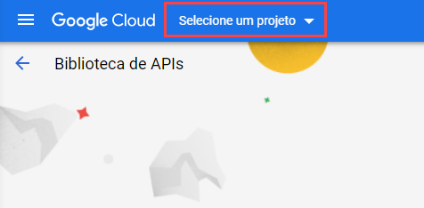

3. Crie ou selecione um projeto:

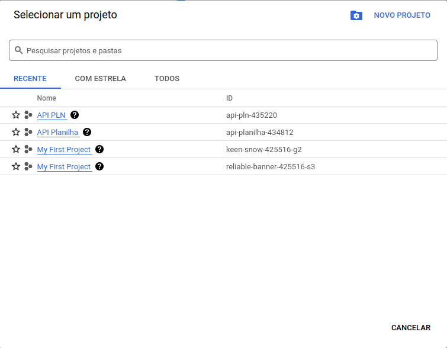
### Criando um projeto
1.  Informe um nome e a organização que seu projeto será vinculado
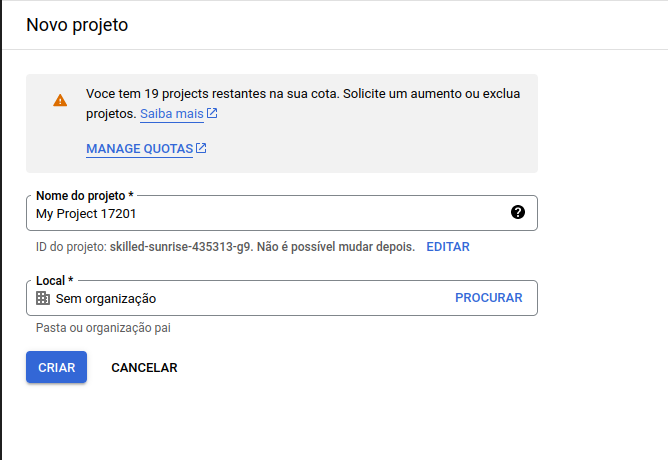

Lembrando que para contas gratuitas, existe um limite de criação 25 projetos.

2. Em seguida, clique no item **"Selecionar Projeto”** para acessar o projeto.

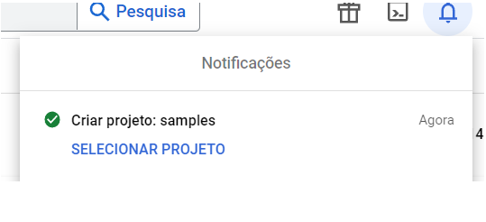

### Ativando a API do Google Planilhas
1. Com o projeto selecionado, irá ser apresentado a seguinte seção:
   
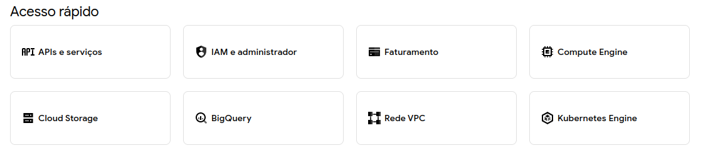

Basta clicar em API's e serviços e uma nova tela será aberta:

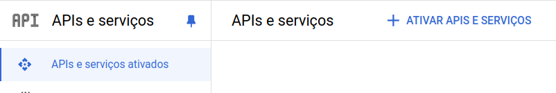

Clique no item **"ATIVAR APIS E SERVIÇOS"**
2. Procure por **"Google Sheets API"**,  selecione a opção e na próxima tela clique em "ATIVAR"

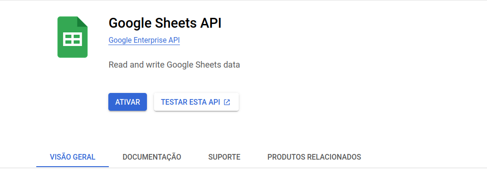

### Configurando a API
1. No menu esquerdo (“APIs e serviços”), clique em **"Credenciais"**

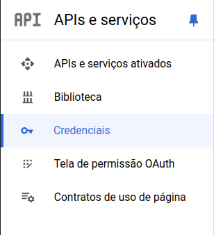

2. Será aberta uma nova tela, clique em **"Criar Credenciais"** e em seguida **"Conta de serviço"**
   
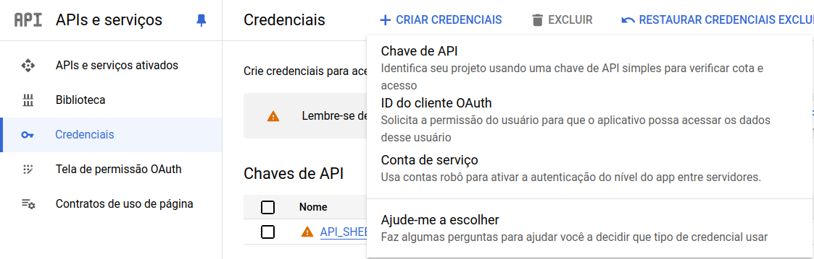

3. Vai ser apresentado o seguinte formulário, que deve ser preenchido com nome que deseja para conta de serviço, o id e descrição da conta de serviço:

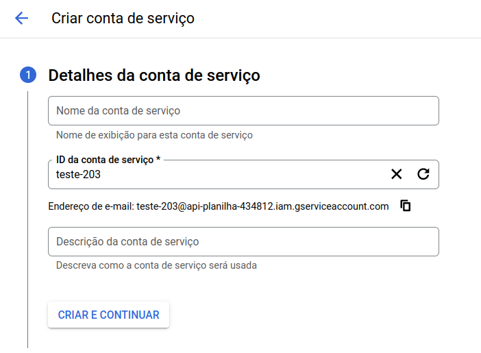

4. Após a criação da conta de serviço acesse no menu **"IAM e administador"** e clique em **"Contas de serviço"**
   
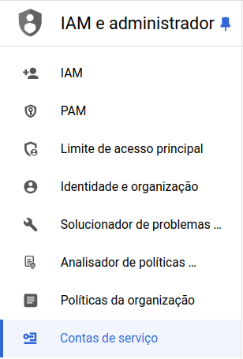

Acesse a conta de serviço que acabou de criar

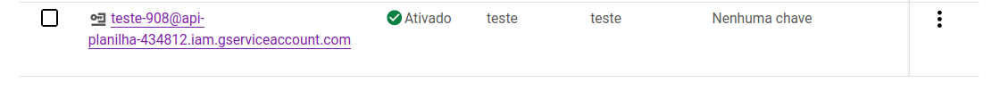

Entre na aba chaves da nova tela aberta e crie uma nova chave:

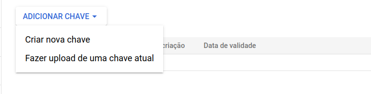

Crie a chave no formato JSON:

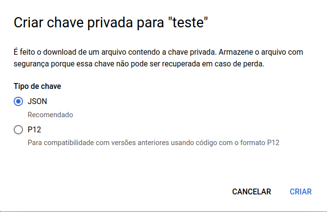

Após o download, já é possível acessar a API com as credenciais baixadas.

### Configurando a environment
O projeto possuí um arquivo chamado env.example, onde é necessário configurar suas variáveis. O arquivo possuí a seguinte estrutura:
```
APP_PORT=4200
PATH_CREDENCIAIS=credenciais.json
PLANILHA_URL='https://docs.google.com/spreadsheets/d/exemplo-planilha'
DISCORD_WEBHOOK_URL='https://discord.com/api/webhooks/exemplo-url-webhook'
INICIO_PLANILHA=4
```
* APP_PORT é a porta onde a aplicação vai rodar;
* PATH_CREDENCIAIS é o caminho do arquivo de credenciais baixado anteriormente na configuração da API
* PLANILHA_URL é a url da planilha que deseja deixar a automação
* DISCORD_WEBHOOK_URL é URL do WEBHOOK do discord
* INICIO_PLANILHA é a linha que deseja inserir o novos dados, para não sobrescrever cabeçalhos

Inicialmente copie o conteúdo para env principal com o seguinte código:
```
cp env.example .env
```
Depois configure com os seus dados.
### Configurando o Gitlab e o Webhook
Como o projeto é pensando em desenvolvimento local, iremos utilizar uma abordagem não muito recomendada de expor o localhost utilizando o ngrok.
Para instalar o ngrok, siga os seguintes passo no site do [ngrok](https://dashboard.ngrok.com/get-started/setup/linux).
Após a instalação, basta expor o localhost com a porta da aplicação ou utilizar um dominio estático que ngrok disponibiliza.
```
ngrok http http://localhost:8080
```
Caso queira expor a porta 80.
Após rodar este comando o ngrok fornecerá algumas informações, o que importante para aplicação é o **Forwarding** que será a URL que redirecionará para o seu localhost.
Com o a URL copiada, vamos vincular o webhook ao evento de merge do gitlab. Para isso deverá entrar no projeto no gitlab e nas configurações do projeto acessar a aba webhooks:
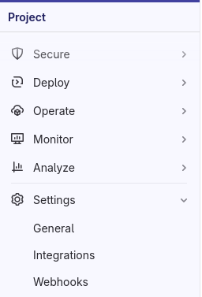

Crie um novo webhook:
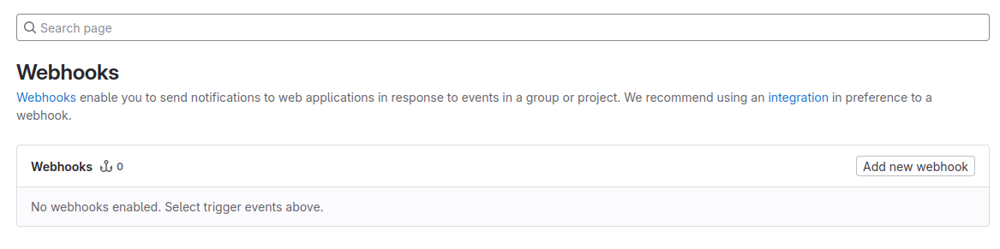
Nesta seção, vamos utilizar a url copiada do ngrok para vincular no gitlab:
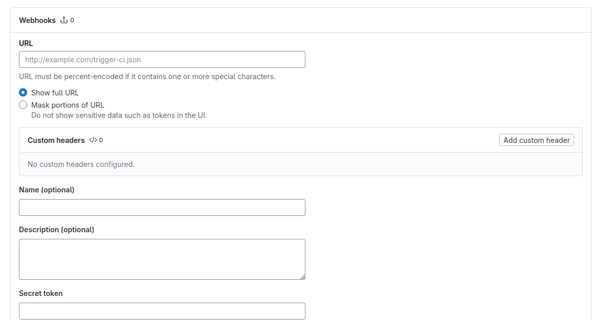
Agora precisamos configurar o evento de gatilho para o webhook, no caso do projeto são o Merge request events
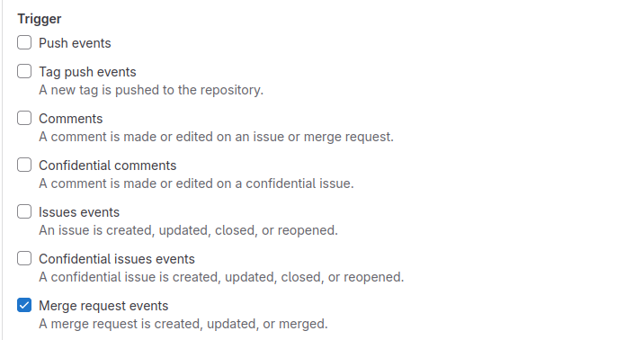

Por fim basta adicionar o webhook.
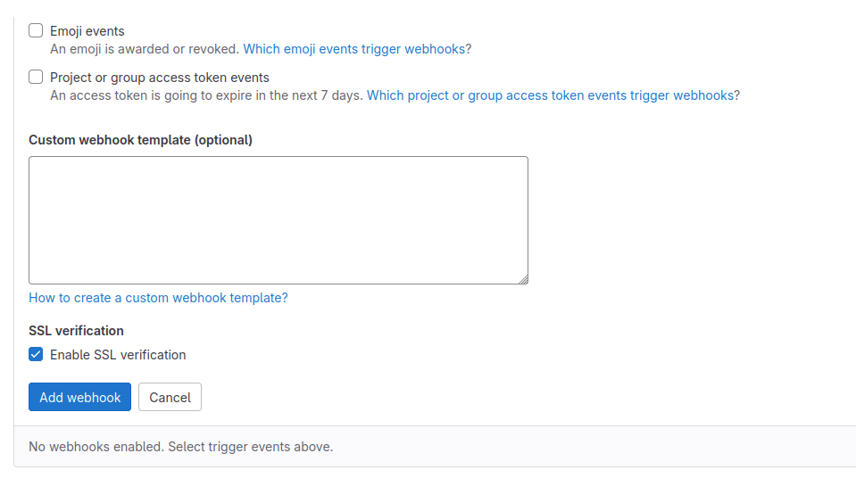

## Execução
Agora para o projeto funcionar, basta rodar a aplicação. Entre na pasta do projeto e rode o seguinte código:
```
python3 app.py
```
